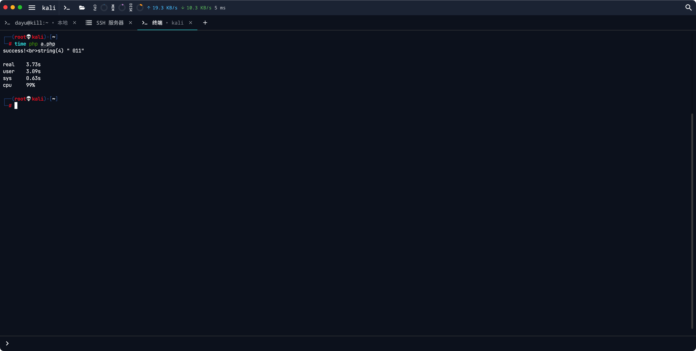
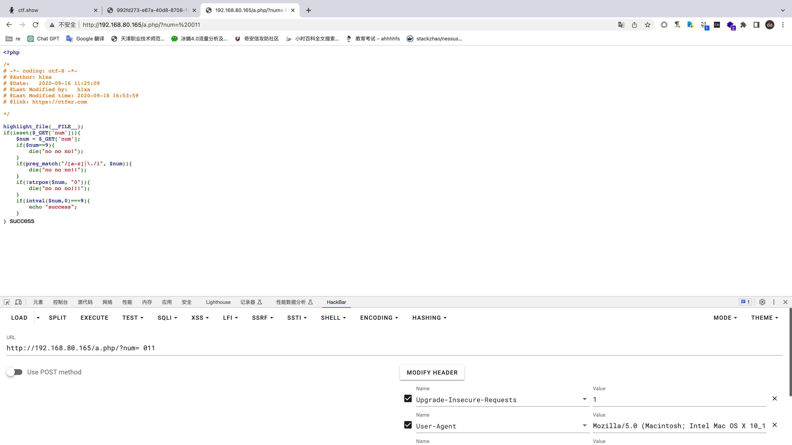

# fuzz

不会fuzz，别喷我。
早上刷ctfshow的时候的想法，因为php弱类型太扯🥚了。网上看了一下也没相关的东西就想着自己来写一个。

题：

```php
<?php

/*
# -*- coding: utf-8 -*-
# @Author: h1xa
# @Date:   2020-09-16 11:25:09
# @Last Modified by:   h1xa
# @Last Modified time: 2020-09-18 16:53:59
# @link: https://ctfer.com

*/

include("flag.php");
highlight_file(__FILE__);
if(isset($_GET['num'])){
    $num = $_GET['num'];
    if($num==4476){
        die("no no no!");
    }
    if(preg_match("/[a-z]|\./i", $num)){
        die("no no no!!");
    }
    if(!strpos($num, "0")){
        die("no no no!!!");
    }
    if(intval($num,0)===4476){
        echo $flag;
    }
}
```

解：

```
?num= 010574
```

8进制的10574就是10进制的4476，但是为什么前面加个空格intval也能正常跑。。。草，因为php所以我就得做这种题。。。有意义吗？。。。然后就想着写个fuzz来跑这种情况，本来想着用python直接跑web来着，后面感觉不舒服就打算用php来实现。

demo:

```php
<?php

$dict = array();
$test1 = array();

for ($i=32; $i<=126; $i++)	//取可见字符，即ascii从32到126，为字典。
{
    $dict[] = chr($i);
}

$test = $dict;

function test($num)	//修改题目，插桩？反正就是配合下面的fuzz函数做判断，主要是把数字改小一点，不然5位字典就几千万了，栈直接爆了。
{
    if($num==9){
        return 1;
    }
    if(preg_match("/[a-z]|\./i", $num)){
        return 2;
    }
    if(!strpos($num, "0")){
        return 3;
    }
    if(intval($num,0)===9){
        return 4;
    }
    return 5;
}

function fuzz($array)
{
    foreach ($array as $value)	//从字典里面挨个试。
    {
        //echo $value."<br>";
        switch (test($value))
        {
        case 1:       
            break;
        case 2:        
            break;
        case 3:
            break;
        case 4:	//fuzz成功，打印一下参数
            echo "success!"."<br>";
            var_dump($value);
            return 1;
        case 5:
            break;
        }
    }
    return 0;
}

function add()	//叠加字典
{
    global $dict,$test,$test1;
    $test1 = array();
    foreach ($dict as $value)
    {
        for($i=0; $i < sizeof($test); $i++)
        {           
            $test1[] = $test[$i] . $value;
        }
    }
    $test = $test1;
}

add();
add();
add();	//已经4位字典了,5位不行，直接爆了。
fuzz($test);
```

基本上没优化就这样吧，能跑就行。



不到4秒。

OK:



看了下fuzzing的其他库和文档，虽然看不懂但是感觉挺有意思的，以后有空了可以玩玩。
